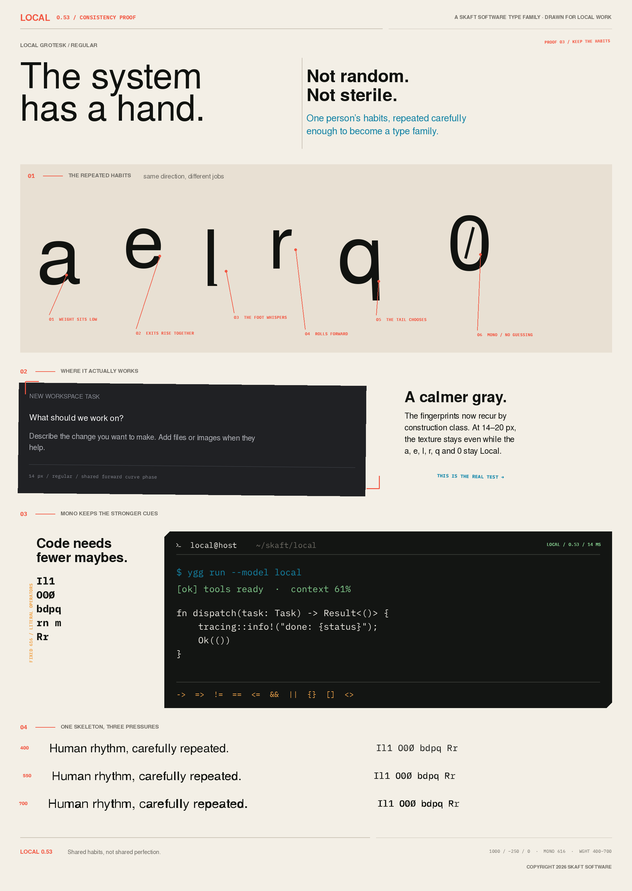

# Local



Local is Skaft Software’s type system for interfaces, documentation, code,
terminals, and open-source tools.

It pairs two related families:

- **Local Grotesk** — a proportional sans for product UI, editorial text, and
  identity.
- **Local Mono** — a 616-unit monospaced face for code and terminal work.

The forms combine Swiss spacing discipline with restrained lower-half gravity,
open counters, differentiated ambiguity forms, delayed curve apexes, and tiny
authored construction biases. The result is precise at work and visibly made
when you look closely.

## Download

Install the fonts from the latest
[GitHub release](https://github.com/skaft-software/local-typeface/releases/latest).

Terminal users will usually want:

- `LocalMonoNerdFontMono-Regular.ttf`
- `LocalMonoNerdFontMono-Bold.ttf`

Web projects can copy `fonts/web` and `web/local.css`:

```css
font-family: "Local Grotesk", sans-serif;
font-family: "Local Mono", monospace;
```

Both variable families support `wght` from 400 through 700.

## Repository map

- `fonts/static` — Regular and Bold TTF and OTF builds
- `fonts/variable` — variable TTF builds
- `fonts/web` — variable WOFF2 builds
- `fonts/nerd` — Local Mono with Nerd Fonts symbols
- `sources/fontforge` — editable SFD masters
- `sources/designspace` — variable-font designspaces
- `sources/scripts` — construction, build, rendering, and validation tools
- `specimens` — release and control proofs

## Build

The checked-in SFD files are the canonical editable 0.53 masters. To rebuild
the core static and variable fonts:

```sh
python3 -m venv .venv
. .venv/bin/activate
python -m pip install -r requirements-dev.txt
make build
```

This requires FontForge on `PATH`. Rebuilt files are written to `build/0.53`
so the checked-in binaries remain untouched.

The `build_release_053.py` and `build_control_053.py` scripts document the
deterministic transformations from the named upstream bases. They require
local checkouts of the exact upstream sources described in `NOTICE.md`; those
checkouts are intentionally not vendored here.

Nerd Font builds require Nerd Fonts `v3.4.0`. Added symbols retain their
upstream licenses.

## Validation

The 0.53 release passes:

- FontForge `fontlint` on all four static masters
- OpenType Sanitizer on static, variable, and Nerd Font outputs
- HarfBuzz shaping at weights 400, 550, and 700
- exact 616-unit Local Mono ASCII width checks
- variable-axis outline-change checks on approved control glyphs
- core-outline and metric preservation after Nerd Font patching

Both families use shared `1000 / -250 / 0` vertical line metrics. Programming
operators remain literal; Local does not add decorative coding ligatures.

## Licensing and lineage

Local modifications and project materials are copyright 2026 Skaft Software.

- Local Grotesk is a modified and renamed work based on TeX Gyre Heros 2.004
  and is distributed under the GUST Font License.
- Local Mono is a modified and renamed work based on IBM Plex Mono 2.5.0 and
  is distributed under the SIL Open Font License 1.1. The reserved name
  “Plex” is not used.
- Nerd Font symbols retain their respective upstream copyrights and licenses.

OpenDyslexic and Atkinson Hyperlegible Mono informed visual comparison and
legibility principles; their outlines are not included. Local makes no claim
of clinical validation for dyslexia.

See [LICENSE](LICENSE), [NOTICE.md](NOTICE.md), and [LICENSES](LICENSES) for
the complete terms.
